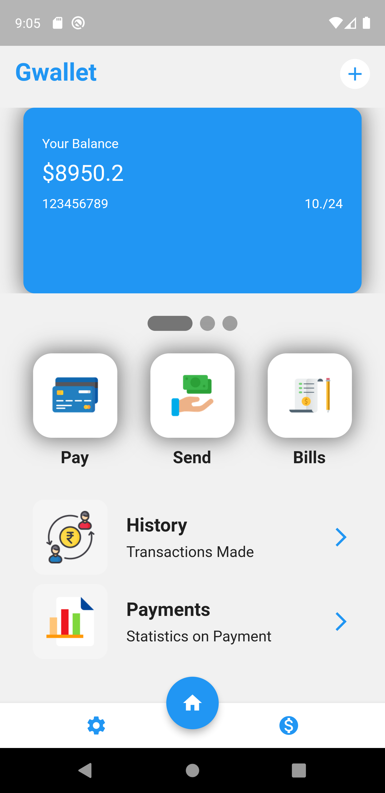

# Gwallet

A Simple wallet application written in Flutter and Dart for Android and iOs.




## Getting Started

<b>For Android, Specifically</b>. You can run iOS, by starting a virtual machine.

Firstly, you need to have flutter installed on your local machine. Head over to <a href="https://flutter.dev">Flutter's Offcial Site</a> to download the latest version. Then install <a href="http://gradle.org">Gradle Build tools for Android</a>. You would need to install command line tools for Android

- Clone this Repository.
```sh
git clone https://github.com/grayoj/gwallet_flutter_app.git
```
- Configure ``pubsec.yml``. All icons included in this repository are from <a href="https://iconscout.com">Iconscout</a>, they are all Free Images.

A few resources to get you started if this is your first Flutter project:

## How to run the App

I actually deployed the application on a Pixel 3XL. You could select any emulator, download, to deploy the application.

If you are on VsCode, which I used:

- Run as administrator.
- After cloning and configurations.
- Start the emulator. You can do this by clicking a bottom bar in your VsCode indicating ``android sdk``
- Next up, head over to your terminal.
Simply `` Ctrl + J``
- In your terminal, I expect you have acceted all Android Licenses for the sdk.
- Now run the following command, and include the ``-v`` verbose flag to display any erros that may occur in the build.
```sh 
flutter run -v
```

The app should startup successfully!


## Application Structure

The application structure is as follows:

| Filename/Folder      | Description |
| ----------- | ----------- |
| Main.dart      | Practically the ``index`` of the application       |
| lib/  | Contains necessary units and components of the app, such as icons and utilities.        |
| Pages/ | Contains the ``home_page.dart``
| Pubspec.yaml | Application icon imports, defines essential units and componets including the sdk.

## License

MIT Licensed.

## Contributions

Feel free to modify, fork and generate pull requests as well.

## Credits

<a href="https://iconscout.com">Iconscout</a> - For the icons used in the Project.

## Contact

Mgeraldoj07@gmail.com
